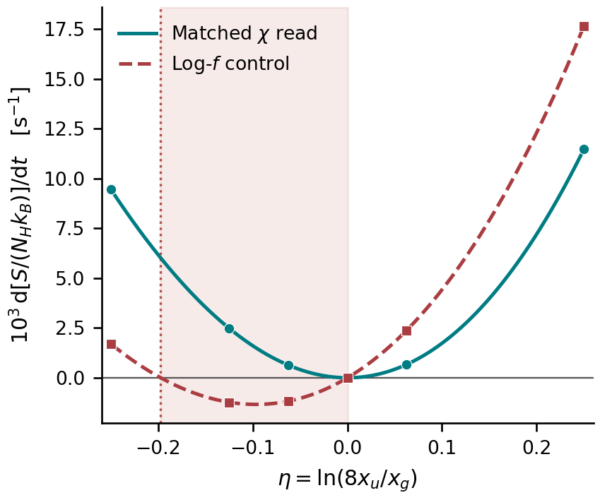

# PR77 수용과 고정 map의 affinity 호환 조건

## 결과와 적용 범위

PR77의 기존 전용 GitHub Actions 실행은 **10/10 PASS**이며 새 실행으로
재집계하지 않는다. 이번 대화에서는 같은 두 노드·분배 map을 소비하는 새
엔트로피 판별기를 **한 번 실행하여 3/3 PASS**를 얻었다. 두 읽기 연산의
12개 사례를 독립 80/120자리 Decimal 기준과 대조했다. 생산 코드·기존
시험·고정 oracle·허용오차는 수정하지 않았다.

이번 판정은 `PASS_BOUNDED_FIXED_MAP_SINGLE_FIELD_COMPOSITE_JVP` 수용과
`PASS_BOUNDED_AFFINITY_DISCRIMINATOR`다. `NO_PASS_REC_PHYSICAL_SPLIT`,
`physical_source_authenticated=false`, `provider_admitted=false`는 유지한다.
이 결과는 실제 우주 재결합의 엔트로피 감소를 예측하지 않는다. 제조된
불일치 이산화의 결함을 보여주는 반례다.

## 기존 실행의 수용 근거

- 실행 source: `4125f7f39b29b710ad6ca673520ae46a426b564f`.
- 실행 tree: `bc5d7f0dbf477ccb693084dd9cd72e4e54bde25e`.
- [run 34079604895 / job 101612248678](https://github.com/cosmosapjw-quantum/rec_bianchi/actions/runs/34079604895/job/101612248678).
- Python 3.12.14, NumPy 2.2.6, SciPy 1.15.3, SymPy 1.14.0, mpmath 1.3.0.
- 실제 checkout과 workflow SHA 일치; 초기/최종 working tree clean.
- 원래 paired source와 COM source의 blob 및 실제 import 경로 확인.
- 정확한 10 TestID가 전부 PASS; failures/errors/skips=0, 종료값 0.
- chi 읽기의 3개 상태 × 8개 방향에서 최대 scaled JVP 오차는
  `3.101240562848418e-16`; 척도는 `abs(error)/(1+abs(reference))`다.
  80/120자리 기준의 최대 scaled 차이는 `3.49717865802442e-81`이다.
  log-control JVP는 한 상태의 혼합 방향에서 따로 비교했다. test_10의
  중앙차분은 독립 reference를 대상으로 하며 실제 compose perturbation
  검사가 아니다. 실제 API JVP 대조는 test_02와 test_03의 근거다.
- 평형 mixed-direction 정확 기준 `dGamma=55/2304`와
  `drhs=(-55/9216,55/9216,275/6912,275/4608)` 대조 완료.
- 평형 count Jacobian의 rank-one 구조와 비영 고유값
  `-1921/432 s^-1`, 고정 H=4 s^-1에서 tau 고유값 `-1921/1728` 확인.
  다른 세 영모드가 있으므로 Planck 평형의 유일성은 성립하지 않는다.
- density/H/log-return/companion 미분 누락의 검출 차이는 각각
  약 0.378, 0.378, 0.189, 0.0521이다.

`evidence/pr77/RESULT_EXTRACTED.json`은 원본 job log의
`RESULT_BEGIN..RESULT_END` 구간에서 줄별 timestamp만 제거한 JSON이다.
원본 job log는 `JOB_*.json`의 UTF-8 `content` 문자열로 손실 없이 보존하고
그 원문 SHA-256과 byte 수를 기록했다. 외부 문서의 공백을 지우지 않으면서
Git의 텍스트 공백 검사와 충돌하지 않는 가역적 저장 형식이다. Actions
artifact의 존재·metadata·digest는
조회했지만 archive를 다운로드하거나 그 digest를 다시 계산하지 않았다.
따라서 archive 바이트 수령이나 전체 manifest 인증으로 과장하지 않는다.

일반 CI run 34079604892와 34079630826은 별도로 **FAIL**이다. 두 raw job
log의 실패는 `committed_feature_range` 공백 검사이며, feature base는
`e6b64e0df25d0b1db7cf8b776866db0afc14721e`다. 실패한 7개 경로는 PR76→77
사이에 blob이 모두 불변임을 확인했다. import smoke는 성공했고 전체
repository pytest는 skipped다. 기존 evidence를 공백 정리하여 덮어쓰지
않았고, 저장소 전체 GREEN을 주장하지 않는다.

## 직접 유도: 엔트로피와 읽기 affinity의 필요충분 조건

수소 정지계, 서명 (-,+,+,+), 고정 양의 측도 mu와 nH, 양의 nodal f,
한 개의 두 광자 반응, 고정 g=1을 가정한다. 광자 에너지는
`E=(1,4)E0`, `E0=2^-60 J`, 원자 에너지차는 `3E0`다. 에너지·시간 단위를
자연단위로 바꾸지 않는다. `h=2*pi*hbar=6.62607015e-34 J s`는 원래 API에서
에너지를 주파수로 바꾸는 데 사용한다. 유한 차원 순간 source 연산이며,
경계 수송·boost·이동 map·실제 시간 적분은 없다.

beta_i=mu_i/nH, count 상태 w=(xu,xg,beta_i*f_i), D_i=B_it+B_ic 및
반응 벡터 v=(-1,1,D_i)를 둔다. `wdot=v*Gamma`이고 양의 정·역률은

    F=a*xu*(1+fc)*(1+ft), R=a*xg*fc*ft, Gamma=F-R.

N_H와 부피를 고정한 무차원 엔트로피는

    s=S/(N_H*k_B)
     =-xu*ln(xu)-xg*ln(xg)
      +sum_i beta_i*((1+f_i)*ln(1+f_i)-f_i*ln(f_i)).

이 제조 g=1 규약의 상수항은 원자수 보존에 의해 미분에서 사라진다.
chi_i=ln(1+1/f_i)라 하면 실제 분배의 엔트로피 방향은

    A_sc = v^T grad(s) = ln(xu/xg)+sum_i D_i*chi_i,
    ds/dt = Gamma*A_sc.

반응률에서 읽힌 occupation의 affinity는

    A_read = ln(F/R) = ln(xu/xg)+chi_t_read+chi_c_read.

고정 광자 상태에서 읽기가 원자 population에 의존하지 않는다고 하자.
Delta=A_read-A_sc는 population ratio와 무관하며

    ds/dt = R*(exp(A_sc+Delta)-1)*A_sc.

**모든 양의 원자 population ratio에서 ds/dt>=0이려면, 그리고 그러기만
하면 Delta=0이다.** 충분성은 `(exp(A)-1)*A>=0`에서 따른다. 필요성은
Delta!=0일 때 A_sc=-Delta/2로 잡으면 두 인자의 부호가 반대가 되어
`ds/dt<0`임을 보이면 된다. 이 ratio는 원자 총합을 양의 상수로 유지하면서
언제든 선택할 수 있다. Delta=0이면 동등하게

    ds/dt=(F-R)*ln(F/R)>=0,

이며 F=R에서는 연속적으로 0이다. `ln(F/R)`는 무차원이고 F,R,Gamma는
H^-1 s^-1, ds/dt는 수소 원자당 k_B로 정규화한 s^-1이다.

필요조건은 **쌍의 affinity 합**

    chi_t_read+chi_c_read = sum_i D_i*chi_i

의 일치다. 각 leg의 읽기 가중치가 개별적으로 B와 같아야 한다는 더 강한
명제는 증명하지 않았으며 일반적으로 필요하지 않다. 기존 chi 후보
`chi_s=sum_i B_is*chi_i`는 이 조건을 만족하는 한 충분한 구성이다.
또한 이 한 반응에 대한 필요조건을 합산된 다반응 source에 아무 조건 없이
필요조건으로 옮길 수 없다. 다반응에서 모든 개별 반응이 이를 만족하면
총 엔트로피 생성률이 비음수라는 충분성은 유지된다.

## 제조 반례와 새 실행

원래 두 노드 f=(1,1/15), 분배
`B=[[2/3,1],[1/3,0]]`, mu=(2,4) m^-3, nH=8 m^-3,
a=1 s^-1, H=4 s^-1를 사용한다. 원자 총합은 xu+xg=9/16으로 유지하고

    eta=ln(8*xu/xg), xg=(9/16)/(1+exp(eta)/8), xu=xg*exp(eta)/8

로 매개화한다. 이 총합은 두 활성 원자준위의 분율이며 나머지는 고정된
spectator로 둔다. 의도된 정확 fixture에서 A_sc=eta다.

일치한 chi 읽기는 ft=1/3, fc=1이므로

    Gamma_chi=(8*xu-xg)/3, A_read=eta.

원래 2점 log-f 대조는 ft=1/sqrt(15), fc=1이며

    Gamma_log=2*xu*(1+1/sqrt(15))-xg/sqrt(15),
    A_read=eta-eta0, eta0=ln(4/(1+sqrt(15)))=-0.19741198517097966329...

다. 따라서 **eta0<eta<0 전체에서** Gamma_log>0이나 A_sc<0이어서
`ds/dt<0`이다. 이 열린 구간의 부호는 직접 유도 결과다. 실제 실행에서는
입력 z를 binary64로 구성하고 그 값을 정확히 나타내는 독립 고정밀
primal과 별도로 비교한다.

eta=-1/8의 실제 API 출력:

| 양 | chi 읽기 | log-f 대조 |
|---|---:|---:|
| Gamma [H^-1 s^-1] | -0.019842916699674945 | +0.009823386150496466 |
| A_read | -0.125 | +0.07241198517098013 |
| A_sc | -0.125 | -0.125 |
| ds/dt [s^-1] | +0.0024803645874593647 | -0.0012279232688120582 |
| Gamma*A_read [s^-1] | +0.002480364587459368 | +0.0007113308922585617 |
| 광자수 회계 잔차 | 0 | 0 |
| 에너지 회계 잔차 / E0 | 0 | 0 |

`Gamma*A_read`가 양수라는 검사만으로 nodal entropy 생성을 인증하면 잘못된
결론을 얻게 된다. 실제 저장된 상태의 엔트로피를 미분해야 한다.
같은 이유로 올바른 합성 JVP는 선택한 연산의 정확한 미분을 뜻하지만,
그 연산의 열역학적 적합성까지 자동으로 보장하지 않는다.

새 실행 source는 `7eb64cb8d65c1fa22f49c019f3c8ce4fb1d22bdc`, tree는
`09a39358a7da53f467fb4d889157174d1d40eaa8`이다. 3개 TestID 전부 PASS,
failures/errors/skips=0, 외부 subprocess의 실제 returncode=0이다.
Python 3.12.13, NumPy 2.3.5 환경에서 설치 없이 실행했다. 이 환경에
SymPy/mpmath는 없지만, 기존 PR77의 결과는 원래 CI의 해당 환경과 함께
수용했고 새 판별기는 표준 Decimal의 독립 80/120자리 primal을 사용한다.

- 12개 API 사례의 최대 scaled 기준 오차: `4.746399864361692e-16`.
- 모든 사례의 기록된 수·에너지 회계 잔차: binary64에서 0.
- 실제 count-state vector field 방향으로 엔트로피 함수 자체를 독립
  중앙차분했다. 이는 실제 진화 적분이 아니다.
- h=(2^-8,2^-12,2^-16) s의 마지막 절대 미분 오차는 chi에서
  `6.8983e-14 s^-1`, log 대조에서 `8.3697e-15 s^-1`이며, 각 단계에서
  약 256배 감소했다. 양·음의 생성률 부호를 따로 확인했다.

## 그림과 문헌

그림의 실선/파선은 고정된 정확 제조 스펙트럼에 대한 위 해석식이고,
원/사각형은 실제 API 관측값 6개씩이다. 붉은 음영은 log 대조의 음의
엔트로피 구간이다. 세로축은 `10^3*ds/dt`이며 평형에서 반올림된 0을
로그축 하한으로 옮기지 않는다. 단일 열 폭 90 mm에서 읽을 수 있도록
제작한 벡터 SVG와 PNG를 제공한다. 오류막대가 없는 것은 실제 우주론
오차가 0이라는 뜻이 아니다. 이 그림은 조건부 유한모형의 결정론적 진단이다.

SciSpace에서 찾은 [Hirata, PRD 78 (2008) 023001](https://arxiv.org/abs/0803.0808)의
원 arXiv 초록은 두 광자/Raman 처리가 복사수송 및 공명 중복계수 문제와
연결됨을 확인해 준다. 이 연구의 실제 atomic kernel 인증은 하지 않는다.
[Markowich–Pareschi의 Boson Boltzmann 방법](https://arxiv.org/abs/1009.2748)은
질량·에너지 보존, 엔트로피 부등식과 Bose 평형 보존을 함께 다루는
방법론적 선행연구다. arXiv 등록은 2010년이지만 논문 journal reference는
Numerische Mathematik 99 (2005), 509–532다.
[Maas–Mielke의 detailed-balance gradient 연구](https://publications.imp.fu-berlin.de/2658/)
역시 구조적 배경이다. 여기서는 각 페이지의 초록/서지를 확인했으며,
원문 전체의 정리를 전용하거나 문헌이 이 코드를 검증했다고 주장하지 않는다.
위 필요충분 조건과 부호 반례는 이번 직접 유도 및 별도 수치 검증이다.

## 다음 한 작업

`REC_MULTI_BIN_AFFINITY_COMPATIBILITY_RESEARCH`: 이미 고정된 2s 기본/hires
표와 단일 광자 상태의 각 source-bin 읽기·분배를 연결할 때, bin별
`Delta_b=chi_tb+chi_cb-D_b^T chi`를 평가하고 총 엔트로피 생성·합성 JVP를
검증한다. 실제 가중치·측도를 먼저 명시하고, 제조 map이면 그렇게 표시한다.
표의 출처만으로 target map을 물리적으로 인증하지 않는다. 이 결과의
다음 과학 질문은 호환 조건과 실제 고차 보간·양의 보존적 분배가 공존하는지다.

이번에는 그 다반응 작업이나 실제 BASS/REC coupling을 시작하지 않았다.
원본 BASS 실행·기존 성공 시험을 반복할 필요가 없으며, 현 단계에서
local Codex로 넘겨야만 하는 실행은 없다. 결과와 반환 인계는 Git에서
직접 읽을 수 있게 게시한다. Draft 유지; merge/ready는 수행하지 않는다.
