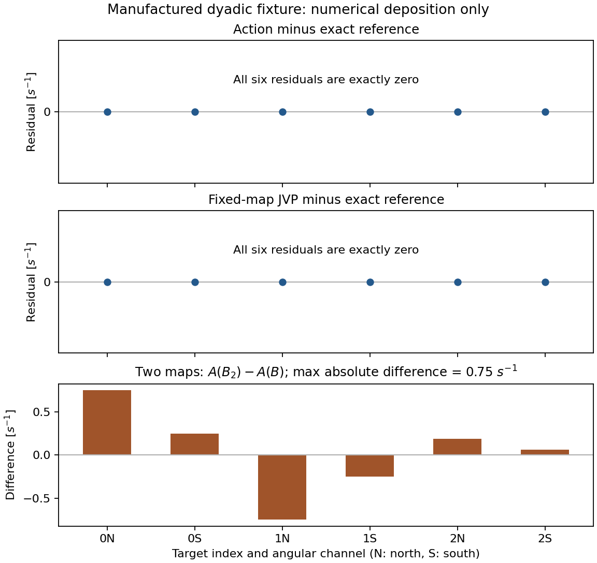

# REC-DONOR-02C resolved numerical deposition checkpoint

`PASS_BOUNDED_RESOLVED_NUMERICAL_DEPOSITION_ADAPTER`

`NO_PASS_REC_PHYSICAL_SPLIT`

## DAG and exact source

PR60 amended source protocol COMPLETE -> PR61 explicit-map component probe COMPLETE
-> this typed resolved numerical adapter EXECUTED on manufactured inputs.
PR62 is a handoff-only sibling; it did not implement the adapter. The initial
live PR/branch census found no implemented successor. Historical PR60/61
results are prior evidence, not added to the fresh test counts below.

| Role | Commit | Tree |
|---|---|---|
| Fixed parent / PR61 publication | 30576407d50e10b88a32b65a9510db61e4159e1b | c9ceccb9a66162d4f76832b85756b8c66692895d |
| This source and actual tested checkout | 3a8e32c3b13054b8f0e71fc861a39c69aa8b1625 | 41aab828da46266dc53b5b1977fe6e8c064df22d |

The source is a direct child of the fixed parent. The result-document child
is not claimed to have been numerically re-executed. Publication/readback and
append identifiers are recorded in a later `PUBLICATION.json` and in the
Draft PR body, without attempting a same-commit self-hash.

Worktree: `/workspace/scratch/ae018d984864/rec02c-work`.
Operator Dropbox checkout was absent and was not modified. An isolated bare
clone and worktree were used. No old branch, dirty/untracked file, historical
receipt, fixture, source core, manifest, force-push, ready or merge was changed.

## What changed

- `src/full_bianchi_hyrec/resolved_deposition.py`: declared typed axis identities,
  actual plan snapshot, typed packet input, existing apply/JVP delegation,
  immutable numerical receipts and marked occupation outputs.
- `tests/trajectory/test_rec_resolved_deposition.py`: bounded behavior, Fraction,
  identity, refusal, mutation-safety and reproducibility coverage.
- `scripts/probe_rec_resolved_deposition.py`: one bounded local runner; logs and
  outputs are external to Git during execution. No new workflow was necessary.
- This result directory: checkpoint, structured result, actual residual PNG
  and EVIDENCE.zip containing raw execution/development evidence.

The physical-source blob `6d4f39d48993c4715f5002ba068e8dcf98336be3`,
COM blob `a3662cf399f14b7148d880266825be12baf934a0`, historical probe blob
`fcfca64cd113800e2dee6a7a955c2c4453b53a84`, and historical CLOSEOUT blob
`812f1a841511fbaf8fe4f8d3dec222b3d1c8614d` are unchanged.

## Actual execution

```bash
cd /workspace/scratch/ae018d984864/rec02c-work
/workspace/scratch/ae018d984864/rec02c-venv/bin/python -B \
  scripts/probe_rec_resolved_deposition.py \
  --out /workspace/scratch/ae018d984864/rec02c-execution
```

Actual runner exit: 0. Source checkout clean before and after.
Python 3.12.13; NumPy 2.3.5; SciPy 1.17.0; pytest 9.1.1;
SymPy 1.14.0; Matplotlib 3.10.8. Dependencies were provisioned in a separate
venv; the global environment was not installed into. This is the Work runtime,
not the operator workstation or PR61's former hosted runtime.

| Fresh test group | Top-level passed | Subtests passed | Failures/errors/skips |
|---|---:|---:|---|
| Resolved adapter | 83 | 0 | 0/0/0 |
| donor01 + donor02 source safety | 27 | 9 | 0/0/0 |
| Existing deposition component subset | 15 | 0 | 0/0/0 |

Total: 125 top-level tests plus 9 subtests; JUnit records 134 cases.
The component subset deliberately deselects 12 unrelated context tests.
Exact subprocess commands and observed counts are in RESULT.json and raw
logs/XML in EVIDENCE.zip. No broad repository suite or frozen prior-stage
runner was invoked by this numerical validation.

Focused RED first: two collected tests, two intended missing-receipt assertion
failures, exit 1, no import/collection errors. Expanded contract on the stub:
72 failures/7 passes. Development GREEN: 79 passes. One independent read-only
review then found the ndarray header defect described below; its author
reproduction had three assertion failures. Final source has 83 passes,
including packet/tangent/plan/output header protections.

## PHYS-MATH audit

Established contract: metric (-,+,+,+), hydrogen-rest orthonormal frame,
photon energy J, physical time s, density and measure m^-3, dimensionless B.
R is a signed photon-packet rate per H per second; A is a signed occupation
rate in s^-1, not a positive occupation state. No clipping is applied.

Derived at fixed B, measure, energy and angular grid:

```text
A[i,a]  = n_H / mu[i] * sum_s B[i,s] R[s,a]
dA[i,a] = 1 / mu[i] * sum_s B[i,s] (n_H dR[s,a] + dn_H R[s,a])
```

Both terms have s^-1 units for a dimensionless perturbation parameter.
With zero rates the action vanishes; zero rate and density tangents give zero
JVP; a density-only variation scales the action by dn_H/n_H. Finite positive
base density is required; signed density directions are permitted.
The scalar number/energy identities follow by contracting the stipulated
column constraints. Fraction checks cover both maps and both directional and
isotropic inputs: 24 action and 24 JVP scalar comparisons, zero residual;
directional number/energy and photon/source four-moment consistency also pass.
SymPy fixed-map and full differential identities each reduce to zero.
The latter is a formula-only check: moving-map/measure inputs remain rejected.

For the stipulated directional fixture, all six A(B) and dA(B) entries match
the user-supplied exact arrays. B2 preserves the same number/energy moments,
but max abs(A(B2)-A(B)) is 0.75 s^-1. This directly rules out selecting a
physical map from those moments alone. Neither map is promoted. No detailed
balance, Planck equilibrium, continuous-sphere reconstruction, time integration,
positivity evolution or universal binary64 error bound is established here.

## PHYS-MATH-CODE audit and one bounded repair

The adapter calls actual COMSourceDepositionPlan.apply and .jvp once per
corresponding evaluation; the call-count test observes exactly [apply,jvp].
It duplicates no deposition formula. Plan validity remains owned by COM.
Packet and plan layouts must match source, ordered source channels, target,
ordered target/angular channels, measure, frame, time and units. A same-length
foreign source/layout is rejected. Isotropic (S,) and directional (S,A) are
accepted; scalar and implicit (S,1) angular replication are rejected.

All six actual plan arrays enter the plan digest. R, density, ordered labels,
and for JVP dR/density tangent/scope enter input identity. Actual output bytes,
shape, input identity and plan identity enter result identity. Success receipts
are produced after successful finite, correctly shaped numerical output.
Every receipt keeps authentication and provider flags false.

One independent reviewer examined both audit perspectives, not two independent
reviewers. It found one P1: read-only NumPy storage still allowed ordinary dtype
header assignment, changing effective input/plan/output values without changing
the corresponding digest. This was reproduced and repaired once by storing
immutable bytes and shape, exposing fresh array headers and fresh COM plans.
All four header-mutation detectors pass. Final disposition is
RESOLVED_BY_EXECUTED_AUTHOR_REGRESSION, not independent post-repair certification.
The original independent review, exact reviewed hashes, reproduction logs and
RED/GREEN evidence are in EVIDENCE.zip.

Marked occupation outputs, their copies and equal-source/target-size output
arrays cannot be redeposited through this typed API. Re-evaluating the same
original PacketRates is allowed and deterministic. Explicitly discarding the
quantity marker and falsely redeclaring raw numerical values cannot be detected
from their bytes; these remain declared input contracts, not authentication.

Five in-memory mutants were tested in separate processes: omit density,
apply conversion twice, omit density JVP term, ignore layout, omit angular
direction identity. All five were detected by actual assertion failures with
exit 1 and zero collection/errors, while on-disk production stayed unchanged.
Two fresh processes produced byte-identical serialized identity dictionaries.

## Figure and visual review



Actual PNG opened with view_image: PASS at the rendered 1152x1088 size.
The first two panels contain the exact action/JVP residuals; the third shows
the signed map-output difference, in s^-1. Number/energy moments are not put on
that occupation-rate axis. No overlap/clipping was observed. Single-column
print-size or journal-publication certification was not performed.

## External source and publication boundaries

Wolfram context failed once at MCP SSE HTTP404 before kernel evaluation;
Fraction and SymPy executed successfully instead. One SciSpace scope search
and the primary [HyRec abstract](https://arxiv.org/abs/1011.3758v2) and
[Hirata two-photon abstract](https://arxiv.org/abs/0803.0808v2) confirm that
physical radiative-transfer treatment is separate from a numerical map.
Those sources do not authenticate the manufactured matrices or certify tests.

Initial live Atlassian readback: BASS-19 and BASS-26 In Progress; latest
handoff comments 10583 and 10584; FED-02 page27492353 latest footer28606465.
These supersede the prompt's prior 10580/10581/28573697 locators. Only REC
results and this PR pointer will be appended. Other repository snapshots,
statuses and official dependency links are not updated.

GitHub publication and Atlassian append are reported independently in the
publication closeout. General repository verification is separate from the
125-test cone. It was not run locally; any remotely triggered result is read
from its own fresh logs and is never inferred from historical hygiene debt.

## One next action and stop

Prepare an owner-reviewable physical deposition input-authority contract that
traces original HyRec packet channels, multiplicities and map/measure provenance
to exact source bytes. Do not implement or admit a provider in that action.

This checkpoint ends REC-DONOR-02C. Physical source/map authentication, moving-map
and event JVP, accepted-state updates, solver integration, BASS wiring, provider
export and full REC physical split remain unimplemented/unadmitted.

## Publication route correction

Native Git read/clone succeeded, but one native push failed with exit 128 because
no GitHub username/credential was available to the shell. The authorized GitHub
connector created source commit `2eafa330b41b148531ddd9f0eee26636742a1f07`
with exactly the tested source tree `41aab828da46266dc53b5b1977fe6e8c064df22d`.
It is a direct child of the same fixed PR61 parent. It differs from the tested
local commit only at commit metadata; no new base or numerical replay is implied.

`TESTED_SOURCE.bundle` preserves original local source commit `3a8e32c...` and
local result commit `4afe28a...`, requiring the fixed parent `30576407...`.
Native `git bundle verify` passed. An initial raw-SHA-only bundle specification
was refused as empty; using named HEAD with the same excluded parent repaired
this packaging issue once. This does not alter any source or scientific result.

The final result publication and later synchronization child are connector
commits. Their parent/tree/blob readback is the publication evidence, distinct
from the local actual tested checkout. The complete source tree agrees exactly.
